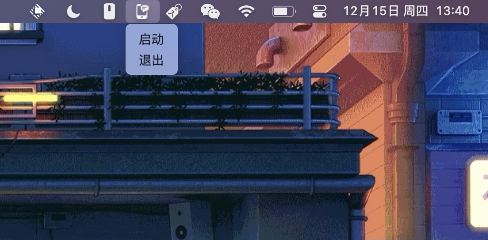

  

# MessAuto

MessAuto 是一款 macOS 平台 **自动提取** 短信验证码并 **粘贴回车** 的软件，百分百由Rust开发，适用于任何APP。

特点：
- 初步支持 中文、英语、韩语
- 支持提取 4-6 位数字和字母组合的验证码类型
- 若来信的公司名称也为 4-6 位数字和字母组合，与验证码类似，则会进行简单判断
- 轻量：程序占用存储 1.8 M，占用内存 10.1 M（原本占用1.6M，但添加了托盘图标的包和相关代码后飙升到 10.1 M）
- 简洁：没有GUI，只有一个安静的任务栏托盘图标，要么开启要么退出
- 适用性广：Safari方案只能在Safari浏览器中使用，此软件适用于任何APP
- 开源免费：收费方案[2FHey](https://2fhey.com/)至少需要5美元

⚠️注意：若要使用 arm64 版本，请先将软件移入应用程序文件夹，再在终端中运行`xattr -cr /Applications/MessAuto.app`即可，这个多余步骤的根本原因是作者没有 Apple 开发者账号。

## 开发初衷

macOS平台可以方便地接收来自iPhone的短信，无需每次打开手机查看验证码。Safari浏览器更是可以直接自动获取到验证码并显示在输入框内，然而这个好用的功能却仅仅停留在了Safari浏览器上，但并不是每个人都喜欢使用Safari浏览器。为了把这个功能带到所有APP上，我开发了这款软件，希望对大家有所帮助。

## 要求

- 使用 **macOS系统** （作者是 macOS 13，其他自行测试），并可以接收 **iPhone** 的短信
- 完全磁盘访问权限（为了访问位于 `～/Library` 下的Message的数据库文件，以获取最新的短信）
- 辅助功能权限（模拟键盘操作，自动粘贴并回车）

⚠️注意：使用前请先授予权限。如果你不想使用自动粘贴并回车功能，则拒绝赋予辅助功能权限即可。验证码仍然会自动存储到你的粘贴板上，你可以手动粘贴并登录。

## 已知缺陷
- 部分APP或网站不支持回车登陆，需要手动点击登陆
- 可能无法用于 macOS13 以下的版本，请[自行编译](#自行编译)

## 使用方法

MessAuto 是一个菜单栏软件，启动之后，菜单栏会出现一个图标，点击菜单图标后只有两个选项，开启或退出，使用前请点击一次开启，每次开机开启一次即可。

使用流程：
- 下载软件并拖拽到应用程序文件夹中
- 终端执行`xattr -cr /Applications/MessAuto.app`
- 打开系统设置，手动赋予完全磁盘访问权限和辅助功能权限
- 打开软件，没有任何界面但任务栏中会出现图标
- 点击图标选择开启按钮

## 自行编译

- 安装 Rust 运行环境，细节查看Rust官网
- 执行 `cargo install cargo-bundle`
- 执行 `cargo bundle --release`
- 找到并右键 APP ，选择 显示包内容，修改info.plist,添加
- `<key>LSUIElement</key>`
- `<string>1</string>`

## 感谢

* 感谢 [@尚善若拙](https://sspai.com/post/73072) 提供获取短信思路