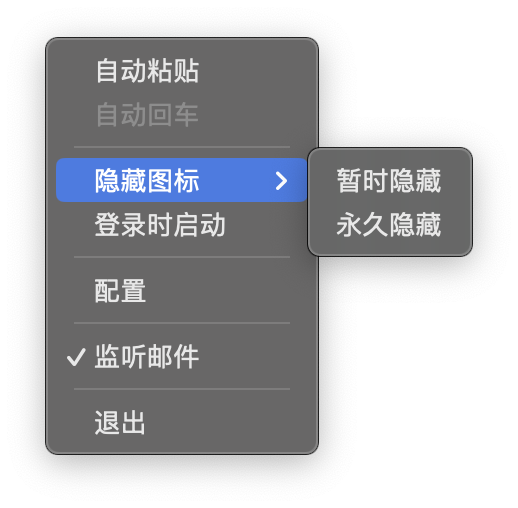

<p align="center">
  
  <h1 align="center">MessAuto</h1>
  <h4 align="center"> 自动提取Mac平台的短信和邮箱验证码</h4>
  <h4 align="center"> Automatic extraction of SMS verification code for Mac platform</h4>
<p align="center">
<a href="https://github.com/LeeeSe/MessAuto/blob/master/LICENSE.txt">
</a>
<a href="https://github.com/LeeeSe/MessAuto/releases">
</a>
<a href="https://img.shields.io/badge/-macOS-black?&logo=apple&logoColor=white">
</a>
</p>

<p align="center">
  [<a href="./README.md">中文</a>] [<a href="docs/README-EN.md">English</a>]<br>
</p>

# MessAuto

MessAuto 是一款 macOS 平台自动提取短信和邮箱验证码的软件，由 Rust 开发，适用于任何 App

下面展示了在 MessAuto 的辅助下完成短信登录的过程

https://github.com/LeeeSe/MessAuto/assets/44465325/6e0aca37-377f-463b-b27e-a12ff8c1e70b

🎉🎉🎉 MessAuto 现在支持邮件 App

https://github.com/LeeeSe/MessAuto/assets/44465325/33dcec87-61c4-4510-a87c-ef43e69c4e9d

## 特点

- 同时支持 Mail.app 和 iMessage.app
- 多语言支持：目前支持汉语，英语，韩语；根据系统语言自动切换
- 轻量：程序占用存储 8 M，占用内存 14 M
- 简洁：没有GUI，只有一个安静的任务栏托盘图标，但功能够用
- 适用性广：Safari方案只能在Safari浏览器中使用，此软件适用于任何 APP
- 自动化：自动粘贴回车，或弹出悬浮窗
- 开源免费：收费方案[2FHey](https://2fhey.com/)至少需要5美元

## 使用方法

MessAuto 是一个没有 GUI 的菜单栏软件，第一次启动时 MessAuto 会弹窗引导用户授权完全磁盘访问权限，授予权限后系统会要求重新打开软件，点击图标列出菜单：

- 自动粘贴：MessAuto 将检测到的验证码存储到你的剪贴板中，如果你在输入验证码时不想手动粘贴，可以启用此选项，启用选项时 MessAuto 会主动提醒您进行辅助功能授权
- 自动回车：在自动粘贴验证码后再自动帮你按下回车键
- 不占用剪贴板： MessAuto 不会影响你当前剪贴板中的内容，并不是不占用，而是在粘贴验证码后会自动恢复你之前的剪贴板内容，无论图片或文字，所以此功能开启时会自动开启自动粘贴功能
- 暂时隐藏：暂时隐藏图标，应用重启时图标重现（需先退出后台），适合不经常重启 Mac 的用户
- 永久隐藏：永久隐藏图标，应用重启也不会再显示图标，适合经常重启 Mac 的用户，若需重新显示图标，需要编辑 `~/.config/messauto/messauto.json` 文件，将其中的 `hide_forever` 设置为 `false`，并重启应用
- 配置：点击后将打开json格式的配置文件，可以在其中自定义关键词
- 日志：快速打开日志
- 监听邮件：开启后将同时监听邮件,要求邮件 App 常驻后台
- 悬浮窗：获取验证码后将弹出一个方便的悬浮窗口

> 关键词: 也叫触发词，当信息中包含如“验证码”等关键词时，程序才会执行一系列后续操作，否则会忽略此条信息

<!-- <p align="center">

</p> -->

## 注意

ARM64 版本打开时会提示文件损坏，因其需要 Apple 开发者签名才可以正常启动，作者没有 Apple 开发者证书，不过你仍然可以通过一条命令解决问题：

- 移动 MessAuto.app 到 `/Applications` 文件夹下
- 终端执行`xattr -cr /Applications/MessAuto.app`

如果 MessAuto 出现无法自动粘贴验证码的问题，一般是没有辅助功能权限或者自动化权限，可以尝试以下解决方案：

1.  打开系统偏好设置 -> 安全性与隐私 -> 辅助功能，将其中 MessAuto 删除，并添加新的 MessAuto.app
2.  运行`tccutil reset AppleEvents com.doe.messauto`来重置 MessAuto 的自动化权限,然后重启应用并不断勾选自动粘贴选项来让 MessAuto 主动发起自动化权限请求

## TODO

- [x] 优化验证码提取规则
- [x] 自定义关键词
- [x] 菜单中增加配置选项
- [ ] ~~自动删除提取后的验证码短信（没有有效思路）~~
- [x] 应用内更新
- [x] Github Action 自动发布 release
- [x] 增加日志功能
- [ ] 制作 App 主页
- [x] 增加检测邮件验证码功能
- [x] 添加验证码悬浮窗
- [x] 增强悬浮窗体验：悬浮窗启动位置由当前鼠标位置决定，悬浮窗可移动
- [x] 增强悬浮窗体验：悬浮窗不再获取用户焦点，简化了悬浮窗使用流程
- [x] 解决偶尔 cmd 键未成功模拟按下的问题
- [x] 不再占用剪贴板
- [ ] 优化隐藏图标的逻辑
- [ ] 为 App 签证
- [ ] 发布到 Homebrew

## 开发初衷

macOS 平台可以方便地接收来自 iPhone 的短信，无需每次打开手机查看验证码。Safari 浏览器更是可以直接自动获取到验证码并显示在输入框内，然而这个好用的功能却仅仅停留在了 Safari 浏览器上，但并不是每个人都喜欢使用它。为了把这个功能带到所有APP上，我开发了这款软件。

后续使用中我又发现许多验证码不仅仅通过短信发送，还有通过邮件发送的，所以我又增加了对邮件的支持。

## 要求

- 使用 **macOS系统**，并可以接收 **iPhone** 的短信(即打开了“短信转发”功能)
- 邮件 App 需要常驻后台，否则无法实时获取到最新的邮件
- 完全磁盘访问权限（为了访问位于 `～/Library` 下的 `Message.app` 的 `chat.db` 文件，以获取最新的短信）
- 辅助功能权限（模拟键盘操作，自动粘贴并回车）
- 自动化权限（模拟键盘操作，位置：设置->安全性与隐私->隐私->自动化，此权限只能程序主动请求用户同意，用户无法主动授予）

## 已知缺陷

- 部分APP或网站不支持回车登陆，需要手动点击登陆
- 偶尔会出现未知 BUG 吃满单核 CPU（暂时没找到复现条件）

## 自行编译

```bash
# 下载源码
git clone https://github.com/LeeeSe/MessAuto.git
cd MessAuto

# 编译运行（非必需，仅用于开发测试）
cargo run

# 安装 cargo-bundle
cargo install cargo-bundle --git https://github.com/zed-industries/cargo-bundle.git --branch add-plist-extension
# 打包应用
cargo bundle --release
```

生成的 MessAuto 应用位于 `target/release/bundle/osx/MessAuto.app`。

## 日志目录

日志文件目录：`~/.config/messauto/messauto.log`
仅保留最近一次启动软件的日志

## 常见问题

- 给了权限但还是弹出权限请求：暂时的解决方法是从设置面板的辅助功能和磁盘权限列表中将原来的 MessAuto 通过下面的"-"号移除，当再次弹出权限请求时正常同意即可工作

- 权限都给了，验证码可以提取到剪贴板但不会自动粘贴，可能是程序初次请求自动化权限用户拒绝或直接忽略了，这个权限的位置在：设置->安全性与隐私->隐私->自动化，用户无法直接添加，只能通过程序再次请求，所以只能通过重置权限的方式解决，运行这条命令并重启程序：`tccutil reset AppleEvents com.doe.messauto`，反复勾选自动粘贴选项来触发自动化权限请求：`tccutil reset AppleEvents com.doe.messauto`

## 感谢

- 感谢 [@尚善若拙](https://sspai.com/post/73072) 提供获取短信思路
## 赞助
[](https://dartnode.com "Powered by DartNode - Free VPS for Open Source")
