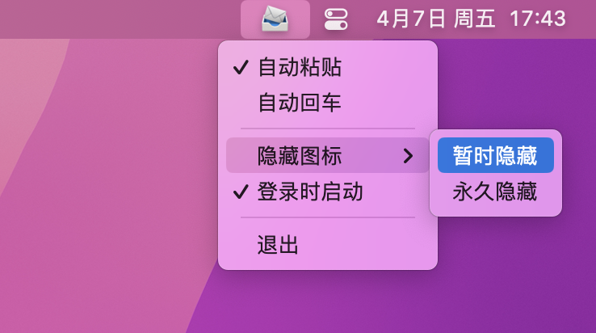

  

  [<a href="./README.md">中文</a>] [<a href="docs/README-EN.md">English</a>] 

# MessAuto

MessAuto 是一款 macOS 平台自动提取 短信和邮箱
验证码到粘贴板的软件，百分百由Rust开发，适用于任何APP，是 [2FHey](https://2fhey.com/) 的免费替代品。

下面展示了在 MessAuto 的辅助下十秒内完成短信登录的过程，点击按钮后只需安心等待5秒左右

特点：

- 同时支持 Mail.app 和 iMessage.app
- 多语言支持：目前支持汉语，英语，韩语；根据系统语言自动切换
- 轻量：程序占用存储 4 M，占用内存 14 M
- 简洁：没有GUI，只有一个安静的任务栏托盘图标，但功能够用
- 适用性广：Safari方案只能在Safari浏览器中使用，此软件适用于任何 APP
- 开源免费：收费方案[2FHey](https://2fhey.com/)至少需要5美元

## 使用方法

MessAuto 是一个没有 GUI 的菜单栏软件，第一次启动时 MessAuto 会弹窗引导用户授权完全磁盘访问权限；授予权限后重新打开软件可在菜单栏看到
MessAuto 的图标，点击图标列出菜单：

- 自动粘贴：MessAuto 将检测到的验证码存储到你的剪贴板中，如果你不想手动粘贴，可以启用此选项，启用选项时 MessAuto
  会主动提醒您进行辅助功能授权
- 自动回车：自动粘贴的更进一步，只有自动粘贴功能启用，自动回车功能才可以被选中
- 暂时隐藏：暂时隐藏图标，应用重启时图标重现，适合不经常重启 Mac 的用户
- 永久隐藏：永久隐藏图标，应用重启也不会再显示图标，适合经常重启 Mac
  的用户，若需重新显示图标，需要删除 `~/.config/messauto/messauto.json` 文件，并重启应用
- 登录时启动：不会有控制狂不打开吧
- 配置：点击后将打开json格式的配置文件，可以在其中自定义关键词
- 监听邮件：开启后将同时监听邮件
- 悬浮窗：类似于 Safari 的悬浮窗，但功能上稍有落后

> 关键词: 也叫触发词，当信息中包含如“验证码”等关键词时，程序才会执行一系列后续操作，否则会忽略此条信息

⚠️注意，ARM64 版本打开时会提示文件损坏，因其需要 Apple 开发者签名才可以正常启动，作者没有 Apple 开发者证书，不过你仍然可以通过一条命令解决问题：

- 移动 MessAuto.app 到 `/Applications` 文件夹下
- 终端执行`xattr -cr /Applications/MessAuto.app`

## TODO

- [x] 优化验证码提取规则
- [x] 自定义关键词
- [x] 菜单中增加配置选项
- [ ] ~~自动删除提取后的验证码短信（没有有效思路）~~
- [x] 应用内更新
- [x] Github Action 自动发布 release
- [x] 增加日志功能
- [ ] 制作 App 主页
- [x] 增加检测邮件验证码功能
- [x] 增加悬浮窗功能
- [ ] 增强悬浮窗体验：TouchArea, Shortcut key ...

## 开发初衷

macOS 平台可以方便地接收来自 iPhone 的短信，无需每次打开手机查看验证码。Safari 浏览器更是可以直接自动获取到验证码并显示在输入框内，然而这个好用的功能却仅仅停留在了
Safari 浏览器上，但并不是每个人都喜欢使用它。为了把这个功能带到所有APP上，我开发了这款软件。

后续使用中我又发现许多验证码不仅仅通过短信发送，还有通过邮件发送的，所以我又增加了对邮件的支持。

## 要求

- 使用 **macOS系统**，并可以接收 **iPhone** 的短信(即打开了“短信转发”功能)
- 邮件 App 需要常驻后台，否则无法实时获取到最新的邮件
- 完全磁盘访问权限（为了访问位于 `～/Library` 下的 `Message.app` 的 `chat.db` 文件，以获取最新的短信）
- 辅助功能权限（模拟键盘操作，自动粘贴并回车）

## 已知缺陷

- 部分APP或网站不支持回车登陆，需要手动点击登陆

## 自行编译

- `git clone https://github.com/LeeeSe/MessAuto.git`
- `cd MessAuto`
- `cargo install cargo-bundle`
- `cargo bundle --release`

## 感谢

* 感谢 [@尚善若拙](https://sspai.com/post/73072) 提供获取短信思路

## 日志目录

日志文件目录：`~/.config/messauto/messauto.log`
仅保留最近一次启动软件的日志