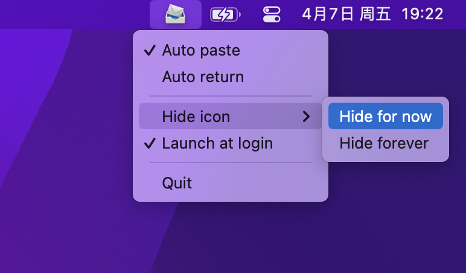

  

  [<a href="../README.md">中文</a>] [<a href="./README-EN.md">English</a>] 

# MessAuto

MessAuto is a macOS app that automatically extracts SMS verification codes to pasteboard. It is 100% developed with Rust and is suitable for any app. It is a free alternative to [2FHey](https://2fhey.com/).

The following GIF shows the process of completing SMS verification and login within ten seconds with the support of MessAuto. After clicking the button, you only need to wait for about 5 seconds.

Features:
- Multi-language support: currently supports Chinese, English, and Korean; automatically switches based on the system language.
- Light-weight: the app occupies 4 M storage and 14 M memory.
- Concise: without GUI, only a quiet taskbar tray icon, but powerful.
- Wide applicability: the Safari plan can only be used in the Safari browser, and this app is suitable for any app.
- Open source and free: the fee-based plan [2FHey](https://2fhey.com/) requires at least $5.

## Usage

MessAuto is a menu bar app without GUI. When you launch it for the first time, MessAuto will pop up a window to guide you to authorize full disk access permission.

After granting permission, you can see the MessAuto icon in the menu bar by restarting the app. Click the icon to list the menu:
- Auto paste: MessAuto stores the detected verification code in your clipboard. If you don't want to paste it manually, you can enable this option. When this option is enabled, MessAuto will actively remind you to authorize the accessibility feature.
- Auto enter: one step further than auto paste. Only when auto paste is enabled, can auto enter be selected.
- Hide for now: temporarily hide the icon. The icon will reappear when the app is restarted, suitable for users who do not often restart the Mac.
- Hide forever: permanently hide the icon. Even if the app is restarted, the icon will not appear again. This is suitable for users who restart Mac frequently. If you need to show the icon again, you need to delete the `~/.config/messauto/messauto.json` file and restart the app.
- Launch at login: Nobody doesn't open it, right?

⚠️ Note that the ARM64 version will prompt a file damage when opened because it needs Apple developer signature to start normally. The author does not have an Apple developer certificate. However, you can still solve the problem through one command:
- Move MessAuto.app to the `/Applications` folder.
- Execute `xattr -cr /Applications/MessAuto.app` in Terminal.

## TODO
- [x] Optimize CAPTCHA extraction rules
- [x] Customized Keywords
- [x] Add configuration options to the menu
- [ ] ~~Automatic deletion of extracted CAPTCHA text messages (no valid ideas)~~
- [x] In-App Updates
- [ ] Github Action automated release
- [ ] Make App Home Page

## Motivation

macOS can conveniently receive short messages from the iPhone without having to open the phone to check the verification code every time. Safari can even directly obtain the verification code and display it in the input box automatically. However, this useful feature is only available in Safari, but not everyone likes to use it. In order to bring this feature to all apps, I developed this app.

## Requirements

- Use a **macOS system** (the author is macOS 13, others can test it by themselves) and can receive **short messages** from an iPhone.
- Full disk access permission (to access the `chat.db` file in `~/Library/Message.app` to get the latest message.)
- Accessibility permissions (simulates keyboard operations, auto paste and enter)

## Known issues

- Some apps or websites do not support Enter login and require manual clicking of login.
- The pre-compiled version may not work for versions below macOS 13, please [compile it yourself](#Build) 

## Build

- `git clone https://github.com/LeeeSe/MessAuto.git`
- `cd MessAuto`
- `cargo install cargo-bundle`
- `cargo bundle --release`

## Thanks

* Thanks to [@尚善若拙](https://sspai.com/post/73072) for providing ideas for obtaining SMS.